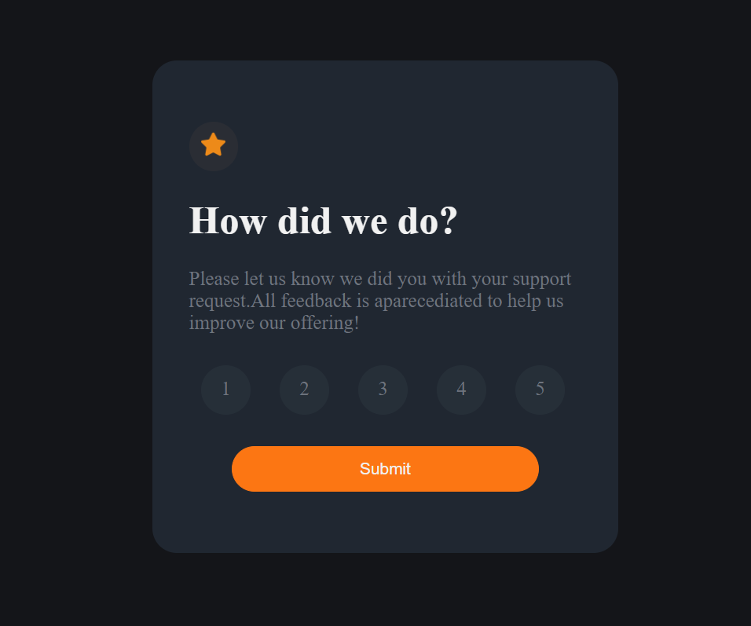

# Challenger - HTML / CSS

Este é um projeto básico para testar conhecimentos em HTML e CSS.

## Visão Geral

O projeto mostra o número selecionado e exibe uma mensagem.

## Estrutura de Arquivos

- `index.html`: O arquivo HTML principal.
- `styles.css`: O arquivo CSS para estilização.
- `app.js`: O arquivo Javascript para interação dinâmica.

## Referências

* [FrontendMento IO](https://www.frontendmentor.io/challenges/interactive-rating-component-koxpeBUmI).
